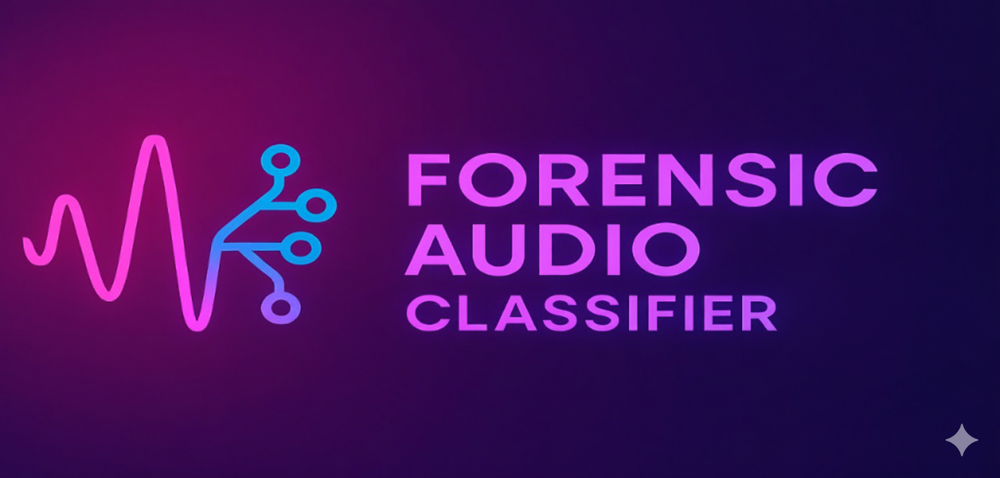

<!-- ===================== PROJECT BANNER ===================== -->

<p align="center">
  
</p>

<!-- ===================== PROJECT TITLE ===================== -->

<h1 align="center">🛡️ Forensic Audio Classifier Tool</h1>

<p align="center">
  <b>Hybrid AM + LM + Classifier Based Crime Speech Detection System</b><br>
  <i>Optimized for Tripura Bengali Dialect</i>
</p>

<!-- ===================== BADGES ===================== -->

<p align="center">
  
  
  
  
  
</p>

<br>


## 👤 Developer Information

**Developer:** Arnab Das  
**Institute:** NFSU Tripura Campus  
**Year:** 2025  

## 📌 Overview

The **Forensic Audio Classifier Tool** is a machine-learning based forensic audio analysis system designed to transcribe, analyze, and classify speech content in **Tripura’s Bengali dialect**, influenced by:

- Comilla  
- Dhaka  
- Noakhali  
- Sylhet  
- Bengali (West Bengal)

The tool automatically categorizes audio evidence into:

- 🚨 **Flagged** — Crime-related audio  
- 🧐 **Review** — Ambiguous or partially suspicious  
- ✅ **Safe** — Harmless speech  

---

## ⚙️ System Capabilities

This tool integrates multiple forensic speech-processing components:

- **Acoustic Model:** Wav2Vec2-BERT (Bangla ASR)  
- **Language Model:** 3-gram KenLM (Tripura Bengali Corpus)  
- **Classifier Model:** Fine-tuned Crime vs. Non-Crime Transformer  
- **Keyword Engine:** Weighted, fuzzy matching & severity scoring  
- **Decision Logic:** Hybrid probability + rule-based detection  
- **Pre-processing:** Silence trimming & audio normalization  
- **Output Formats:** HTML & CSV forensic reports  
- **Audio Segregation:** Flagged / Review / Safe evidence folders  

---

## 🧠 System Architecture

The complete forensic processing workflow consists of:

- Audio Input  
- Acoustic Model (Wav2Vec2-BERT)  
- Language Model (3-gram KenLM)  
- Transcription Generation  
- Keyword Detection Engine  
- Crime Classification Model  
- Hybrid Decision Logic  
- Safe / Review / Flagged Categorization  
- HTML & CSV Report Generation  

---

## 📦 Components

### 🔊 Acoustic Model (Wav2Vec2-BERT)

- **Source:** https://huggingface.co/sazzadul/Shrutimala_Bangla_ASR  
- **License:** CC-BY-SA 4.0  
- **Creator:** Md Sazzadul Islam Ridoy  
- **Integrated by:** Arnab Das  

---

### 📝 3-Gram Language Model (KenLM)

- **Developed by:** Arnab Das  
- **Corpus:** Custom Tripura-Bengali dataset  
- **Purpose:** Improve decoding accuracy & dialect handling  

---

### 🔍 Crime Classifier Model

- **Model Type:** Transformer-based text classifier  
- **Labels:** Crime / Non-Crime  
- **Fine-tuned by:** Arnab Das  
- **Base Model:** Deleted by original author (self-maintained)  

---

## 📁 Folder Structure

```
Forensic-Audio-Classifier-Tool/
│
├── tool.py
├── config.json
├── requirements.txt
├── README.md
│
├── models/
│   ├── language_model/
│   │     ├── lm.arpa
│   │     └── unigrams.txt
│   └── classifier_model/
│
├── keywords/
│   ├── critical.csv
│   ├── high.csv
│   ├── medium.csv
│   ├── low.csv
│   └── context_tokens.csv
│
└── sample_outputs/
      ├── report_example.html
      └── report_example.csv
```

---

## 🚀 How to Run

Follow the steps below to execute the forensic analysis tool:

---

### **1️⃣ Install Dependencies**
```bash
pip install -r requirements.txt
```

---

### **2️⃣ Place Your Audio Files**
```bash
mkdir audios
# place your .wav/.mp3/.opus files in this folder
```

---

### **3️⃣ Run the Forensic Tool**
```bash
python tool.py
```

---

### **4️⃣ Generated Outputs**

#### 📄 Reports
```text
crime_detection_report_<timestamp>.html
crime_detection_report_<timestamp>.csv
```

#### 📂 Segregated Audio Folders
```text
flagged_audio/
review_audio/
safe_audio/
```

---

## 📚 Citation (APA)

Arnab Das, *Forensic Audio Classifier Tool (v0.9): Hybrid AM + LM + Classifier 
System for Crime-Related Speech Detection in Tripura Bengali*, Technical Report, 
National Forensic Sciences University (NFSU), Tripura Campus, 2025.  

---

## 👨‍💻 Author

- **Name:** Arnab Das  
- **Field:** Forensic Audio Research & Development  
- **Institute:** NFSU Tripura Campus (2025)  
